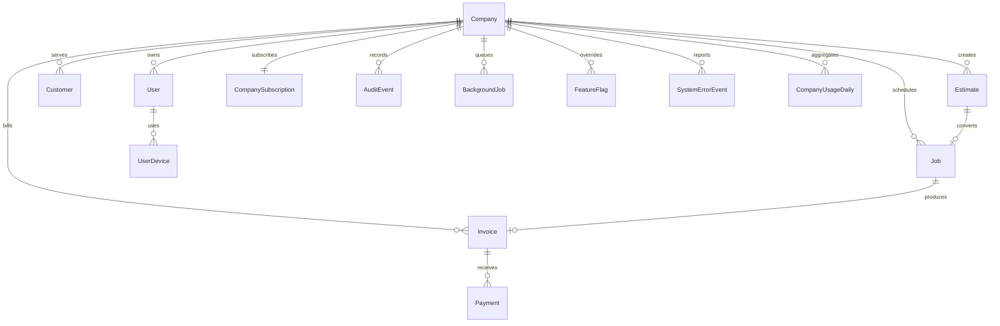

# Entity relationship overview

```mermaid
erDiagram
  Company ||--o{ User : owns
  Company ||--o{ Customer : serves
  Company ||--o{ Estimate : creates
  Company ||--o{ Job : schedules
  Company ||--o{ Invoice : bills
  Company ||--|| CompanySubscription : subscribes
  Company ||--o{ AuditEvent : records
  Company ||--o{ BackgroundJob : queues
  Company ||--o{ FeatureFlag : overrides
  Company ||--o{ SystemErrorEvent : reports
  Company ||--o{ CompanyUsageDaily : aggregates
  User ||--o{ UserDevice : uses
  Estimate ||--o| Job : converts
  Job ||--o| Invoice : produces
  Invoice ||--o{ Payment : receives
```
